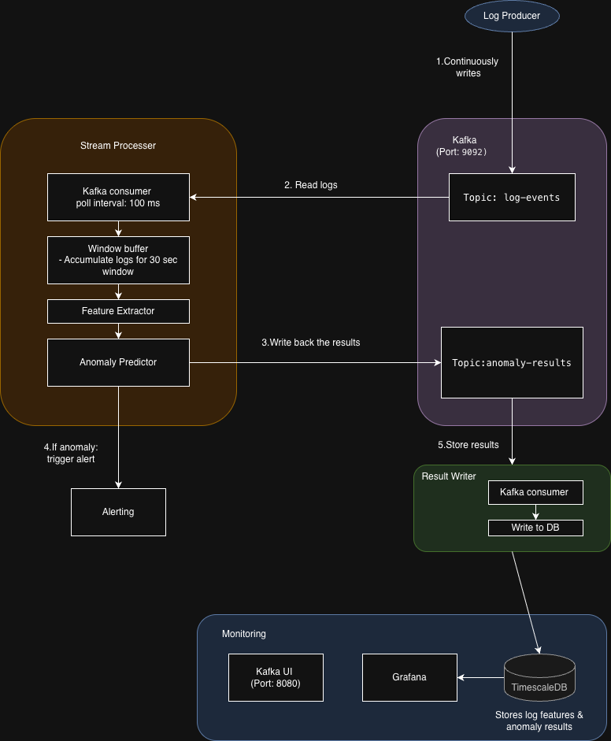

# LogGuard 🛡️

Real-time streaming log anomaly detection system using machine learning.

[](https://www.python.org/downloads/)
[](https://kafka.apache.org/)
[](https://www.timescale.com/)
[](https://opensource.org/licenses/MIT)

---

## Overview

LogGuard is a production-ready streaming pipeline that detects anomalies in log data from distributed microservices. It combines volume-based and semantic analysis to identify both error spikes and unusual error patterns within seconds of occurrence.

**Key Capabilities:**
- 🚀 **Real-time Detection**: Detects anomalies within 30-33 seconds
- 📊 **Dual Analysis**: Volume metrics + text embeddings for comprehensive detection
- 🎯 **High Accuracy**: 83% precision, 77% recall (F1=0.80)
- 🔔 **Instant Alerts**: Automatic logging to alarm file with sample errors
- 📈 **Scalable**: Handles 50k-200k log events per minute

---

## Features

### Core Features

- **Stream Processing**: Kafka-based ingestion with 30-second tumbling windows
- **Feature Engineering**: 30 features (12 volume + 18 text-based)
- **ML-Based Detection**: DBSCAN clustering for density-based anomaly detection
- **Text Analysis**: TF-IDF embeddings with message clustering and rarity scoring
- **Time-Series Storage**: TimescaleDB with automatic partitioning and compression
- **Anomaly Alarms**: Dedicated logging with sample errors and integration hooks

### Advanced Features

- **Message Normalization**: Regex-based preprocessing for consistent feature extraction
- **Template Matching**: 20 KMeans clusters for grouping similar log messages
- **Ground Truth Tracking**: Built-in support for model evaluation and validation
- **Graceful Shutdown**: Processes remaining buffers before stopping
- **Fault Tolerance**: Kafka consumer groups with offset management

---
## Design & Architecture

### System Design
📖 **[Complete Design Documentation](docs/design.md)**

Comprehensive system design covering:
- Architecture diagrams and data flow
- Component details and responsibilities

### Design Decisions
📋 **[ADR Documents ](docs/decisions/)**

---

## Architecture




## Performance

### Latency

| Metric | Mean | Median | P95 | P99 | Min | Max |
|--------|------|--------|-----|-----|-----|-----|
| **Kafka → Detection (ms)** | 14760.5 | 15049.1 | 15055.5 | 15064.1 | 3537.4 | 15071.4 |
| **Total Latency (ms)** | 14760.5 | 15049.1 | 15055.5 | 15064.1 | 3537.4 | 15071.4 |
| **Total Latency (seconds)** | 14.76 | 15.05 | 15.06 | 15.06 | 3.54 | 15.07 |    

### Throughput

| Metric | Capacity | Notes |
|--------|----------|-------|
| **Single Processor** | 6k logs/min | Development setup |
| **10 Processors** | 60k logs/min | Production target |

### Accuracy

| Metric | Value | Interpretation |
|--------|-------|----------------|
| **Precision** | 83.18% | Few false positives |
| **Recall** | 77.39% | Catches most anomalies |
| **F1-Score** | 80.18% | Good balance |

---

## Project Requirements
for mroe details - see [REQUIREMENTS.md](REQUIREMENTS.md)

---

**Tech Stack:**
- **Stream Processing**: Python 3.13 + Kafka Consumer/Producer
- **Message Broker**: Apache Kafka 7.5.0
- **Database**: TimescaleDB (PostgreSQL 15)
- **ML Framework**: scikit-learn (DBSCAN, TF-IDF, KMeans)
- **Orchestration**: Docker Compose (development)

---

## Quick Start

### Prerequisites

- Docker & Docker Compose
- Python 3.13+
- Conda (recommended)

### Installation

```bash
# 1. Clone repository
git clone https://github.com/yourusername/LogGuard.git
cd LogGuard

# 2. Install uv (fast Python package installer)
# macOS/Linux:
curl -LsSf https://astral.sh/uv/install.sh | sh
# Windows:
# powershell -c "irm https://astral.sh/uv/install.ps1 | iex"

# 3. Create environment and install dependencies
uv venv --python 3.13
source .venv/bin/activate  # On Windows: .venv\Scripts\activate
uv sync

# 4. Start infrastructure
docker-compose up -d

# 5. strat the stream processer.

```

### Running the Pipeline

**Automated Startup** (see [start-pipeline.sh](start-pipeline.sh)):
```bash
./start-pipeline.sh
```

**Stop Pipeline**:
```bash
./stop-pipeline.sh
```

### Monitoring

**Kafka UI**: http://localhost:8080

**Anomaly Alarms**:
```bash
tail -f logs/anomalies.log
```

**Database**:
```bash
psql -h localhost -U logguard -d logguard
```

---


## Future Improvements

### Short Term
- [ ] **Grafana Dashboards**: Real-time visualization of anomalies and metrics
- [ ] **Webhook Alerts**: Direct integration with Slack, PagerDuty, email
- [ ] **Log Rotation**: Automated rotation and archiving of alarm logs
- [ ] **CI/CD Pipeline**: Automated testing and deployment workflows

### Medium Term
- [ ] **Adaptive Windowing**: Dynamic window sizes based on log volume
- [ ] **Multi-Service Correlation**: Detect cascading failures across services
- [ ] **Feature Store**: Centralized feature management for consistency

### Long Term
- [ ] **Automated Retraining**: Continuous learning from production data
- [ ] **Explainability**: SHAP values for anomaly explanations
- [ ] **Real-Time Embeddings**: Transformer-based log embeddings (BERT)
- [ ] **Auto-Scaling**: Kubernetes deployment with horizontal pod autoscaling

---
